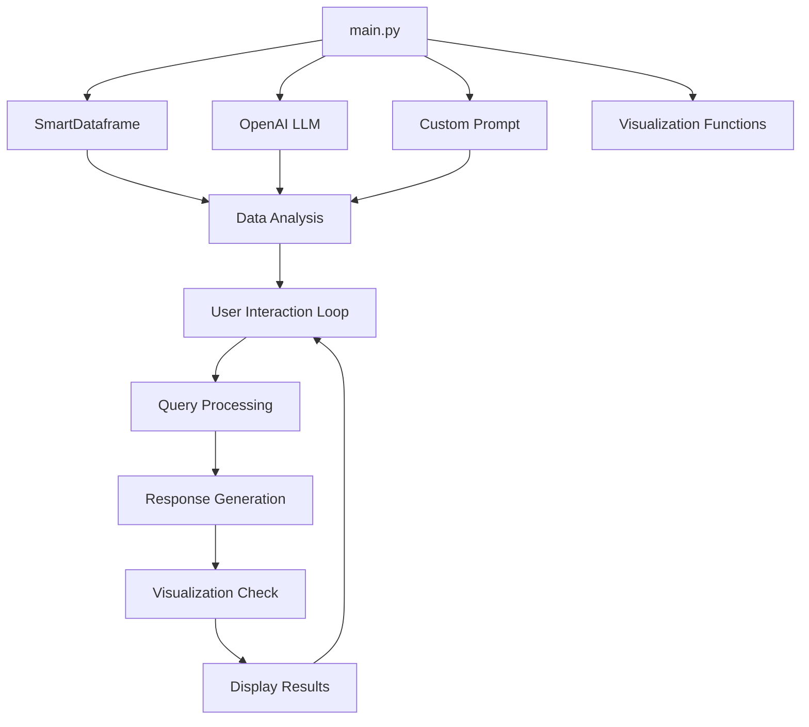

# Data Analysis Assistant

This project implements an intelligent AI-powered Data Analysis Assistant using PandasAI and OpenAI's language models. The assistant can analyze Excel files, provide insights, and create visualizations based on user queries.

## Features

- Interactive chat interface for data analysis
- Custom AI prompt for friendly and professional responses
- Automatic data visualization generation
- OpenAI API usage tracking

## Dependencies

- pandasai
- pandas
- seaborn
- matplotlib
- OpenAI API

## Setup

1. Clone the repository
2. Install the required dependencies:
   ```
   pip install pandasai pandas seaborn matplotlib openai
   ```
3. Set up your OpenAI API key in the script
4. Prepare your Excel file for analysis

## Usage

Run the script and interact with the Data Analysis Assistant through the command line interface. Enter your queries about the data, and the assistant will provide insights and visualizations.

## Project Structure



## Key Components

1. **SmartDataframe**: Initializes the data analysis framework
2. **OpenAI LLM**: Provides the language model for analysis
3. **Custom Prompt**: Defines the AI assistant's behavior and response style
4. **Visualization Functions**: Handles the creation and display of charts
5. **User Interaction Loop**: Manages the chat interface and query processing

## Contributing

Contributions to improve the Data Analysis Assistant are welcome. Please follow these steps:

1. Fork the repository
2. Create a new branch
3. Make your changes and commit them
4. Push to your fork and submit a pull request

## License

This project is licensed under the MIT License.
